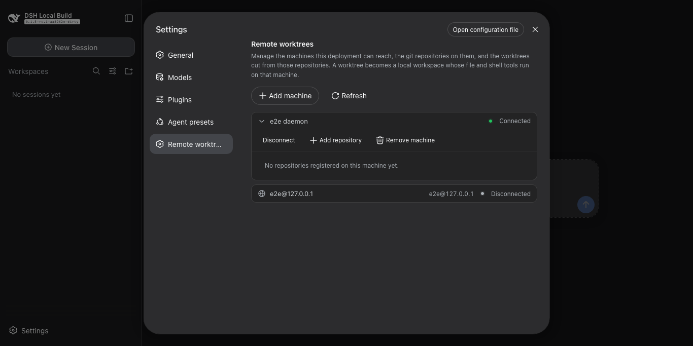
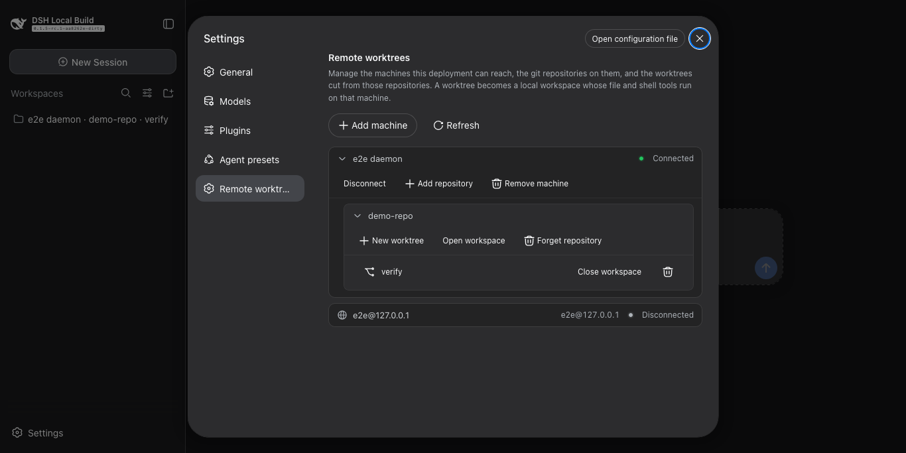

# dsh-workspace

A DSH plugin that puts a directory on a remote machine in front of the harness: read, write, edit, bash, grep, and
terminal tools run there — in a git worktree, or in the directory itself — while the model sees ordinary local paths.

English | [中文](README.zh.md)


| Machines | Connected | A worktree |
| --- | --- | --- |
|  |  |  |

## What it does

- Reaches a machine over SSH — `user@host` or a `~/.ssh/config` alias — and installs nothing there by hand.
- Works on this machine with no setup at all: the built-in `Local` machine needs no agent and no connection, and manages
  repositories and worktrees here exactly as it does on a machine reached over SSH.
- Cuts `worktree/<name>` from any repository on it, and registers the checkout as a DSH workspace.
- Opens a plain directory as a workspace too, before it is a repository; `git init` it later and worktrees can be cut
  from it without registering anything again.
- Runs read, write, edit, bash, grep, and terminal tools on that machine unchanged.
- Removes a worktree without losing work: the checkout goes, the branch stays unless you ask for it.

## Install

Needs Node 22.19+ (or 24+) and `ssh`. The agent is a release download, so no Rust toolchain is required to use it.

```sh
git clone https://github.com/lengmoXXL/dsh-workspace
cd dsh-workspace && npm install && npm run build
dsh plugin --profile web add "$PWD"
dsh --profile web
```

## Use it

**Settings → Remote worktrees.** Add a machine by its SSH destination and a token — any string, it is the daemon's
shared secret. The plugin connects on load and retries a few times per machine; one that stays unreachable is left
failed, with a Connect button to try again.

`Local` leads the list and is always there: it is this machine, so adding a repository to it needs no SSH destination and
no token. A remote machine reaches the same rows through the same form — its destination and token are the whole
configuration.

A repository is any directory on the machine. Each row opens, closes, or removes what it holds, and a directory that is
not a git repository yet can still be opened as a workspace. That section is the whole interface: cutting a worktree is
setup, so it happens here, and the session that follows just works in it.

## How it works

- The plugin replaces the harness's `fs`, `subprocess`, and `shell` seams with routing versions: a path under a remote
  anchor goes to that machine's agent, every other path stays local.
- The agent is one statically linked Rust binary. It binds a kernel-assigned loopback port and publishes it in a state
  file, so a machine is configured by its SSH destination and a token alone — there is no port to agree on.
- The plugin installs and updates it: on connect it reads `uname`, downloads the matching build from this repository's
  GitHub Releases, verifies it against `SHA256SUMS`, uploads it over the same SSH connection, starts it detached, then
  forwards to the port it published.
- Agent traffic reaches your machine through `ssh -L`, so a connection has exactly the trust of your own SSH access.

## Architecture

```text
┌─ browser ──────────────────────────────────────────────────┐
│  plugin/client    the settings section                     │
└──────────────────────────────┬─────────────────────────────┘
                               │ management API over HTTP
┌─ plugin/   the DSH surfaces ─▼─────────────────────────────┐
│  api                          over the models              │
│  routing/  fs · subprocess · shell seams → the SDK         │
└──────────────────────────────┬─────────────────────────────┘
                               │
┌─ models/   the business semantics ─────────────────────────┐
│  worktrees · machines · autoconnect                        │
│  routing   which execution world a path belongs to         │
└─────────────┬───────────────────────────────┬──────────────┘
              │ state                         │ the SDK
┌─ storage/ ───────────────┐  ┌─ remote/   the SDK ──────────┐
│  durable state           │  │  channel · protocol          │
│  anchors · nodes · repos │  │  ssh · agent install         │
│  document: lock + atomic │  │  one channel per machine     │
└──────────────────────────┘  └───────────────┬──────────────┘
                                              │ ssh -L, JSON-RPC 2.0
                              ┌─ machines — one or more ─────┐
                              │  dsh-remote-agent (Rust)     │
                              │  random loopback port        │
                              └──────────────────────────────┘
```

`remote/` turns a machine's daemon into an SDK; `storage/` keeps what has to survive a restart; `models/` is the business
semantics built on both; `plugin/` is the only layer that knows DSH. Imports only ever point downward, and `src/index.ts`
is the one file that assembles the layers. The settings section is the other half — it runs in the browser and reaches
the host through its management API.

## Where the state lives

`$DSH_HOME/remote-worktrees/` holds `nodes.json`, `repos.json`, one anchor directory per remote directory this plugin
addresses, and the agent builds downloaded for each platform. Removing the plugin leaves that directory behind;
deleting it forgets every machine.

## License

MIT
