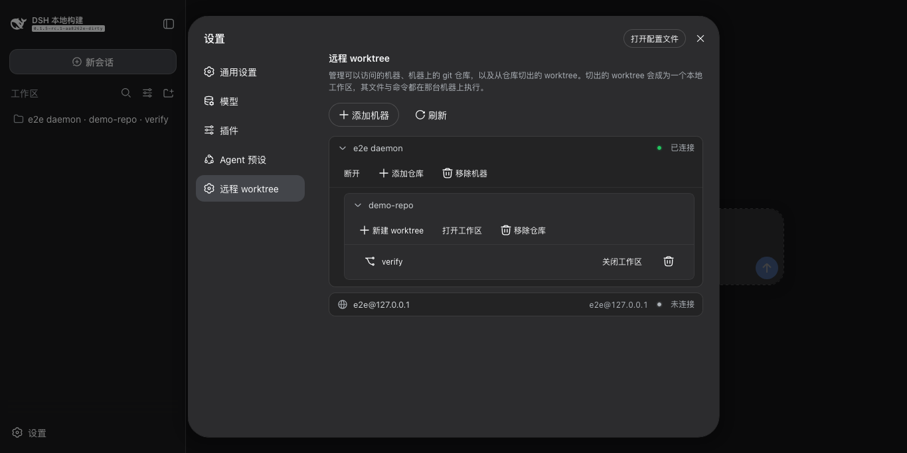

# dsh-remote-workspace

在另一台机器上运行 harness 的工具：它的仓库与 worktree，以及一个人和 agent 共用的终端。模型看到的是普通本地
路径——插件把每个路径路由到拥有它的机器。

**它给你的三件事**

- **在代码所在的地方干活。** 机器上的任意目录——仓库、从它切出的 worktree、或一个普通文件夹——都能成为工作区，
  read/write/edit/bash/grep 全都跑在那台机器上，而不是本机。
- **一个终端，两个人用。** 右侧边栏的终端属于会话，agent 能操作**同一个**：列出开着的终端、读它们的输出、输入
  文本和按键（包括 `ctrl+c`）、等待某段输出出现。它每敲一个键你都实时看得到。
- **一条命令，机器上什么都不用装。** 装上插件、用 SSH 指向一台机器即可；所需的 agent 由插件从 Releases 下载并
  校验，经 `ssh -L` 到达，可信度等同于你自己的 SSH 访问。

[English](README.md) | 中文


| 机器列表 | 已连接 | 切出的 worktree |
| --- | --- | --- |
|  |  |  |

## 环境要求

- Node 22.19+ 或 24+，以及按平时方式配好的 `ssh`。
- DSH `0.1.5-rc.2`——已在可丢弃的 profile 中验证，其他版本未测试。

## 安装

```sh
dsh plugin --profile web add https://github.com/lengmoXXL/dsh-remote-workspace/releases/download/plugin-v0.1.2/dsh-remote-workspace-0.1.2.tgz
```

再把这四行加进 `$DSH_HOME/profiles/web/cordis.patch.yml`——**少了这一步安装就不算完成**：插件要接管 base profile
提供的服务，而 host plane 每项服务只允许一个实现，必须由部署方让出来。漏掉它插件仍会加载，但会在 stderr 上说明
路由未生效。

```yaml
- id: subprocess
  disabled: true
- id: fs-sandbox
  disabled: true
- id: bash-sandbox
  disabled: true
- id: pwsh-sandbox
  disabled: true
```

再用 `dsh --profile web` 启动。tarball 里带着构建好的 `lib/`，本机不编译任何东西；改插件本身时改为 `git clone`、
`npm install && npm run build`，然后 `dsh plugin --profile web add "$PWD"`。

## 能做什么

- 通过 SSH 添加机器（`user@host` 或 `~/.ssh/config` 别名），或直接用内置的 `Local` 机器操作本机。
- 把任意目录登记为仓库；不要求是 git 仓库。可以从它切 worktree、纳入已存在的 worktree、或直接打开该目录；用完
  可以删除，可选择是否连分支一起删。
- 在会话里使用被路由的工作区：工具、终端、文件都在拥有它的那台机器上，而你和模型看到的路径始终是普通本地路径。
- 让 agent 在终端里干活：它列出本会话开着的终端（每个标签有自己的 id）、读输出、输入文本和按键、等待输出——就是
  你正在看的那个 shell，它做的你看得见，你敲的它读得到。
- 终端仍然是你自己的：不受会话沙箱模式约束，agent 既不会创建、也不会结束它。

## 使用

**设置 → 远程工作区。** 用 SSH 目标和 token 添加机器——token 是 daemon 的共享密钥，任意字符串；`Local` 恒在首位，
不需要这两项。机器会自动连接，一直连不上的显示**连接**按钮。登记仓库后，用每行的菜单打开、关闭或移除它持有的
东西。

**终端。** 右侧边栏的添加控件里有一个**终端**按钮；每个会话一个标签页，开在该会话的工作区里。可以开多个：每个
标签是一个独立终端、有自己的 id，你和 agent 都能分得清。终端的寿命**与标签完全一致**——**关闭标签即结束那个
shell**；而隐藏标签、切换会话、收起边栏都不会中断它。

## 配置

| 字段 | 默认值 | 含义 |
|---|---|---|
| `worktreeRoot` | `~/.dsh/worktrees` | 每台机器上切出的检出所在的根目录。 |
| `shell` | 未设置 | 侧边栏终端运行的程序；未设置则用机器自己的登录 shell。 |
| `shellArgs` | `['-l']` | `shell` 之后的参数；`shell` 未设置时忽略。 |
| `graceMs` | `3000` | 关闭终端时留给它退出的时间（毫秒）。 |

MIT
