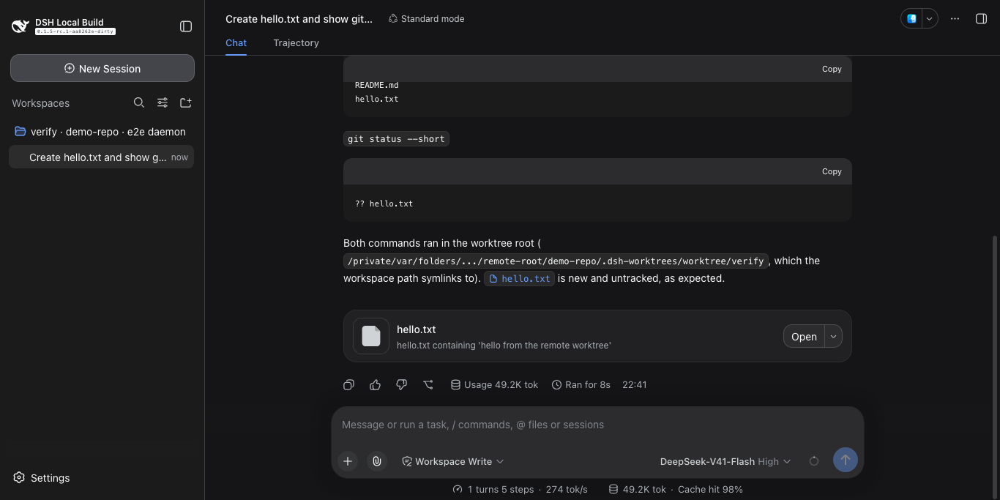
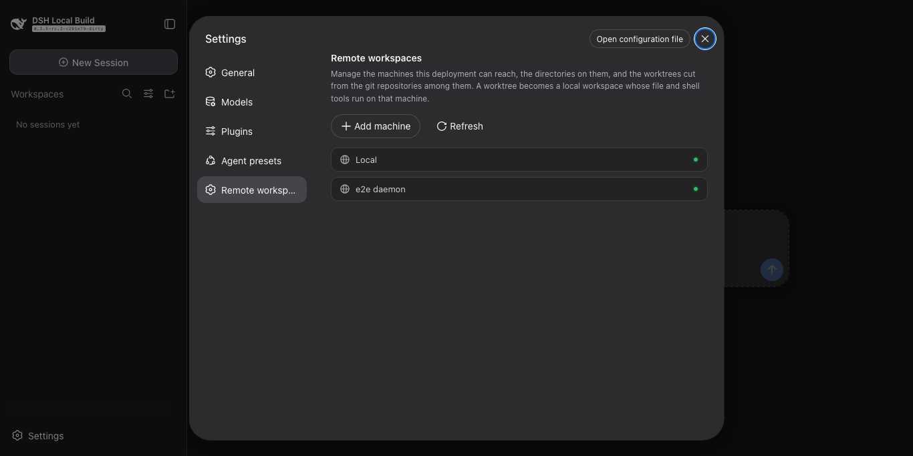
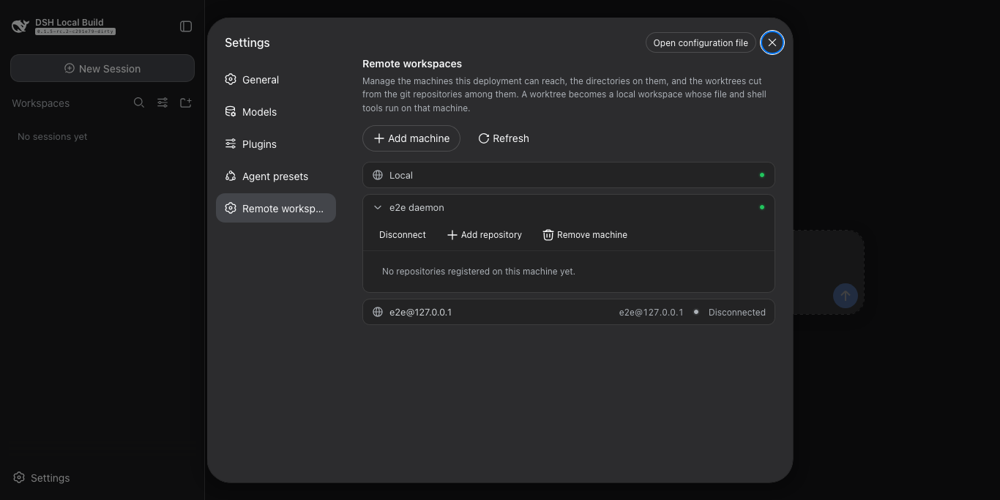
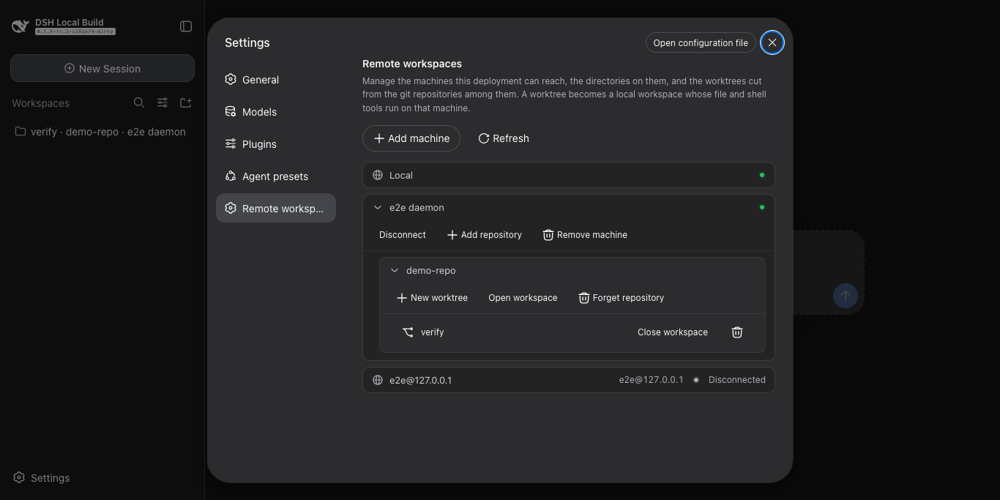

# dsh-remote-workspace

Run the harness's file, shell, and terminal tools against a directory on a remote machine — a git worktree, or the
directory itself. The model sees ordinary local paths. Sibling package: [terminal](../terminal).

English | [中文](README.zh.md)



| Machines | Connected | A worktree |
| --- | --- | --- |
|  |  |  |

## Requirements

- Node 22.19+ or 24+, and `ssh` configured as usual.
- Nothing to install on the machines: the plugin fetches the agent and keeps it up to date.

## Install

```sh
git clone https://github.com/lengmoXXL/dsh-remote-workspace
cd dsh-remote-workspace && npm install && npm run build
dsh plugin --profile web add "$PWD/packages/remote-workspace"
```

Then start the profile with `dsh --profile web`.

## What you can do

- Add a machine over SSH — `user@host` or a `~/.ssh/config` alias — or use the built-in `Local` machine for this host.
- Register any directory on a machine as a repository; git is not required.
- Cut a worktree from a repository and open it as a workspace. The checkout path is filled in for you and can be
  changed.
- Adopt a worktree that already exists on the machine, and release it later without deleting anything.
- Open a plain directory as a workspace; `git init` it later and cut worktrees from it.
- Run read, write, edit, bash, grep, and terminal tools in the workspace, on the machine that owns it.
- Remove a worktree when you are done, with or without its branch.

## Usage

**Settings → Remote workspaces.**

1. Add a machine by SSH destination and token. The token is the daemon's shared secret and may be any string.
   Machines connect on their own; one that stays unreachable shows a **Connect** button.
2. `Local` is always first and needs neither a destination nor a token.
3. Register a repository, then use each row's menu to open, close, or remove what it holds.
4. A workspace you open here is available to Sessions, and its tools and terminals run on the machine that owns it.

## Notes

- Checkouts are cut under the machine's checkout root — `~/.dsh/worktrees/<repository>/<name>` by default.
  `worktreeRoot` moves that root.
- The agent is downloaded from this repository's Releases, checked against `SHA256SUMS`, and reached over `ssh -L`,
  so a connection has the trust of your own SSH access.

MIT
