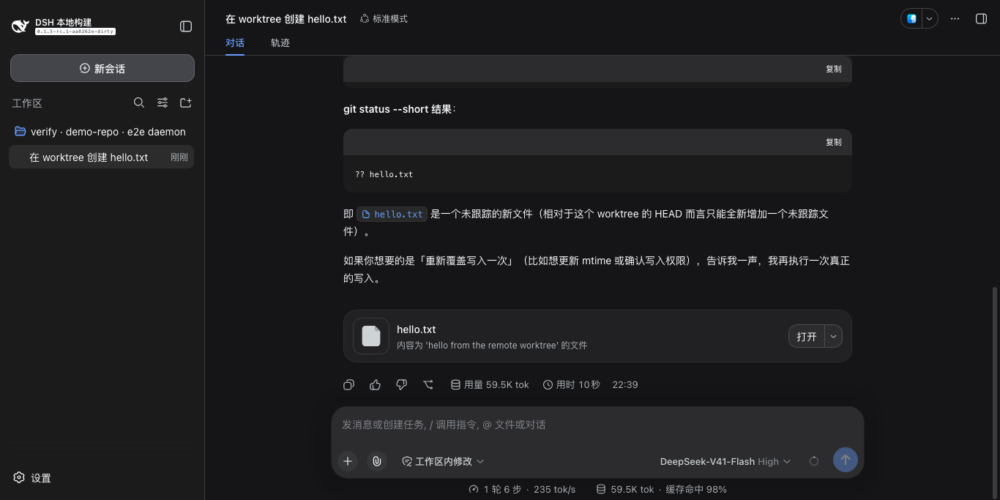
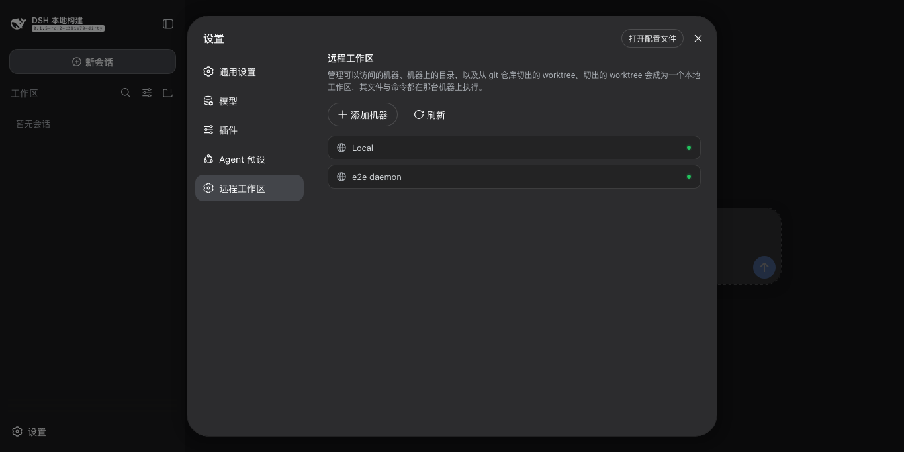
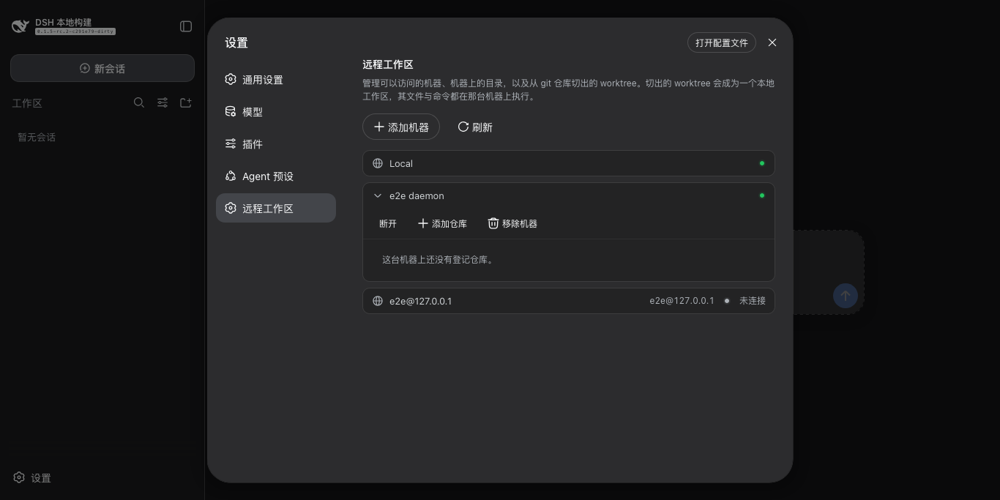
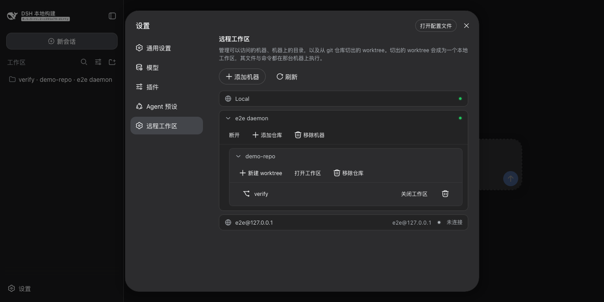

# dsh-remote-workspace

把 Harness 的文件、shell、终端工具跑在远端机器上的某个目录里——git worktree，或目录本身。
模型看到的是普通本地路径。兄弟包：[terminal](../terminal)。

[English](README.md) | 中文



| 机器列表 | 已连接 | 切出的 worktree |
| --- | --- | --- |
|  |  |  |

## 环境要求

- Node 22.19+ 或 24+，以及按平时方式配好的 `ssh`。
- DSH `0.1.5-rc.2`，已在可丢弃的 profile 中验证；其他版本未测试。
- 机器上不需要安装任何东西：agent 由插件下载并保持更新。

## 安装

```sh
git clone https://github.com/lengmoXXL/dsh-remote-workspace
cd dsh-remote-workspace && npm install && npm run build
dsh plugin --profile web add "$PWD/packages/remote-workspace"
```

再用 `dsh --profile web` 启动。

## 能做什么

- 通过 SSH 添加机器（`user@host` 或 `~/.ssh/config` 别名），或直接用内置的 `Local` 机器操作本机。
- 把机器上的任意目录登记为仓库；不要求是 git 仓库。
- 从仓库切出 worktree 并打开为工作区；检出路径会预先填好，也可以改。
- 纳入机器上已存在的 worktree；之后关闭只解除登记，不删除任何东西。
- 把普通目录直接开成工作区；之后在机器上 `git init`，就能从它切 worktree。
- read、write、edit、bash、grep 和终端工具都跑在该工作区所属的机器上。
- 用完的 worktree 可以删除，可选择是否连分支一起删。

## 使用

**设置 → 远程工作区。**

1. 添加机器：SSH 目标 + token。token 是 daemon 的共享密钥，任意字符串。机器会自动连接；
   一直连不上的会显示**连接**按钮。
2. `Local` 恒在首位，不需要目标和 token。
3. 登记仓库，然后用每行的菜单打开、关闭或移除它所持有的东西。
4. 在这里打开的工作区会出现在会话里，其工具和终端都跑在拥有它的机器上。

## 说明

- 检出切在机器的检出根目录下，默认 `~/.dsh/worktrees/<仓库>/<名称>`；配置 `worktreeRoot` 可以改根目录。
- agent 从本仓库 Releases 下载、用 `SHA256SUMS` 校验，并经 `ssh -L` 到达本机，因此连接的可信度等同于你自己的
  SSH 访问。

MIT
